# Patchwork Doodle phones and Chromecast implementation plan

Date: 2026-10-04  
Status: Playable JavaScript prototype verified on Chromecast HD through complete two- and six-player games, with state-by-state TV captures and corrected layouts. Physical phones, the verified deck, Google Cast sender launch and app-store packaging remain outstanding.

Build Patchwork Doodle as a shared living-room game. Chromecast displays the
card circle, token, selected patch, round progress and player readiness.
Each player uses a phone browser to arrange patches on their own quilt.
Intermediate scoring and the final score-counting ceremony are presented
on the TV for everyone to see.

Reuse the existing web party-games platform. Initial scope is the base game,
1–6 players, one TV, browser-based phones, untimed simultaneous play and
automatic scoring. Six is an initial product limit, not a tabletop rule limit.
Doodle Plus, decoration tools, durable saves and larger groups are later work.
Commercial goal: resale through app stores. Before releasing a branded
Patchwork Doodle adaptation, establish written commercial digital rights.
Alternatively, agree on a separately branded original game with original
content and legal review. See [licensing research](research/digital-platforms.md#commercial-release-licensing-review-2026-10-04).
MIT code reuse does not establish rights to the underlying game or its assets.

## Independent implementation and original skins

Will chose an independent implementation. Do not copy or adapt code, card
data, assets or written content from either community repository. Use the
official rules as a research reference and verify the component inventory
independently. The community projects remain documented as research findings.
No DoreyKiss code has been incorporated into the game runtime, and no
DoreyKiss attribution belongs in the app while that remains true.

Keep the existing JavaScript party-games platform. Build original artwork as
interchangeable skins over shared game state, geometry and scoring. Write our
own player-facing instructions. Commercial naming and branding remain a
separate release decision.

## Implementation progress (2026-10-04)

| Phase | Current evidence | Remaining work |
| --- | --- | --- |
| 0 — Research and feasibility | Official rules archived; community reuse explicitly excluded; Cast configuration and room binding coded | Independently verify physical card inventory and scoring-time action interpretations; establish stable HTTPS hosting and Google Cast receiver registration |
| 1 — Geometry and scoring | Placement, orientation, connected cuts, best rectangle and empty-cell deduction tested | Review against complete verified card data |
| 2 — Phone placement | Tap/drag/buttons, rotate/flip, specials, undo, readiness, portrait/landscape and three original development skins | Broader accessibility/device testing and finished artwork |
| 3 — Multiplayer | Phone-first room creation, server-authoritative stages, draft revisions, duplicate handling, server-issued credentials, five-minute reconnect grace, host transfer and late-join waiting | Enforce the initial six-player product limit; production hardening and durable storage if added to release scope |
| 4 — Shared display | 106 physical TV frames; 318 state/skin layouts pass at 960×540; regular and autoplay share committed-board turn overviews with validated Continue | Capture recovery/error states; physical phones, Android 12 and viewing-distance accessibility |
| 5 — Devices and recovery | Chromecast HD full games, ordinary launch, remote input, same-process Home/resume and verified cleanup pass through normal pool allocation | Physical Android/iPhone controllers, Android 12 TV, full-game recovery/rematch and Google Cast sender-button launch |
| 6 — Release | Independent code/art separation; runtime dependency notices collected; npm audit reports zero known vulnerabilities; original square-grid icon and titled TV banner packaged | Icon review/adaptive variants, commercial naming, artwork packs, production hosting and app-store packaging/release checks |

Validation includes seven core tests, one WebSocket integration test, all 36
existing platform regressions, 48 selected coordinator tests, and a complete
two-player browser game with both phone orientations. The development deck
uses independently generated shapes; physical card inventory is still unverified.

| Hardware validation | Evidence | Result |
| --- | --- | --- |
| Two-player full game and final ceremony | [J-f62e22b4423d receipt](../../../docs/diagnostics/patchwork-tv-J-f62e22b4423d/receipt.json) | Complete 18-turn game and verified cleanup |
| Ordinary launch, remote keys and Home/resume | [J-bbb786952d30 receipt](../../../docs/diagnostics/patchwork-tv-J-bbb786952d30/receipt.json) | Same process retained; cleanup verified |
| Six-player full game and state recording | [J-2104f8e72e64 receipt](../../../docs/diagnostics/patchwork-tv-J-2104f8e72e64/receipt.json), [video](../../../docs/diagnostics/patchwork-tv-J-2104f8e72e64/capture.mp4), [frame manifest](../../../docs/diagnostics/patchwork-tv-J-2104f8e72e64/frames/manifest.json) | 106 physical frames; all phases, 18 turns, 36 player scoring steps and final standings; cleanup verified |
| Ordinary play build restored after recording | [Submission/result](../../../docs/diagnostics/patchwork-tv-restore-interactive.txt) | J-59b39dae068a completed and released allocation |
| Autoplay Task with post-turn board overviews | [J-6fe48e975a56 receipt](../../../docs/diagnostics/patchwork-tv-task-boards-verification/game/receipt.json), [turn logs](../../../docs/diagnostics/patchwork-tv-task-boards-verification/game/logcat.txt) | All 18 turn overviews and final ceremony completed; ordinary app restored by J-cf1176c5554a |
| Shared regular/autoplay turn phase | [J-c95d141e2cb1 receipt](../../../docs/diagnostics/patchwork-shared-turn-results-tv/game/receipt.json), [turn logs](../../../docs/diagnostics/patchwork-shared-turn-results-tv/game/logcat.txt), [regular game captures](../../../docs/diagnostics/patchwork-regular-turn-results-gallery/), [ordinary-build restoration](../../../docs/diagnostics/patchwork-shared-turn-results-tv/restored/receipt.json) | Six-player Chromecast game completed all 18 server-authoritative `TURN_RESULTS` pauses and final ceremony; ordinary build restored and checked by J-21e56167ef71; ordinary browser game verifies host Continue and refresh recovery |
| Repeatable browser playthrough Task | [Playthrough log](../../../docs/diagnostics/patchwork-task-playthrough-verification/playthrough.log) | Full phone/TV game passed; isolated server stopped afterward |
| Six-player layout regression in all three skins | [Fit report](test/evidence/tv-states-reviewed/report.json), [check output](../../../docs/diagnostics/patchwork-tv-state-replay.txt) | 106 states × 3 skins = 318 layouts; zero fit failures at 960×540 |

The test players are simulated controllers running inside the owned TV app
session; these receipts do not establish physical-phone compatibility. The TV
uses a thin installed Android WebView launcher, with the game still implemented
in JavaScript. This route is registered in the installed coordinator. Google
Cast sender-button launching remains a separate unverified route.

Normal coordinator pool allocation honors reservations. A temporary HTTPS
origin currently serves the game. Direct LAN hosting timed out, and protected
address rules reject user-owned server replies to the TVs; the rules remain
unchanged. Stable hosting is required before release. See [TV launcher status](tv/README.md).

### TV layout fixes and review gate

The expanded six-player check reproduced overlapping readiness panels, a lobby
roster extending below the display, overflowing round results and oversized
final standings. The implementation now uses compact grid layouts, wraps long
names, reserves space for the footer, and sizes cards to the available area.
Winner text uses the skin's readable ink color. Round results no longer show
“Still placing”; the scoring-preparation state says “Finishing touches”.

Review every normal gameplay state before treating TV presentation as complete:
lobby with six long names, starting patches, every card-pool size and selected
card, none/some/all-ready states, scoring preparation, intermediate results,
final three-card choice, all six scoring steps per player, and final standings.
This coverage is now archived. Disconnect/reconnect, withdrawn seats, late joins,
error messages and unusual name/score combinations remain additional cases.

Repeat the state/skin fit audit after changing TV markup, typography or layout.
Check text against viewport and panel bounds, check footer overlap, and inspect
representative physical frames. Allow six pixels for font ascent in text Range
bounds; viewport and footer checks remain strict. Do not hide overflow to make
the check pass. At 1080p the HD device uses a **960×540 CSS viewport**, so a
1280×720 browser preview alone does not establish fit on the TV.

### Screenshots of the running prototype

[Complete TV screenshot gallery](../../../docs/diagnostics/patchwork-tv-review/index.html):
106 frames from an owned six-player Chromecast recording, plus 318 browser
state/skin checks at the TV's 960×540 CSS viewport. Lobby, long names, readiness,
round results and standings were corrected after the expanded audit. All
normal gameplay phases, turns and final scoring steps are captured.

The older browser captures below show the initial 1280×720 prototype. Use the
gallery above for the current corrected TV layouts and full-resolution physical
frames. Design mockups remain separate from implementation evidence.

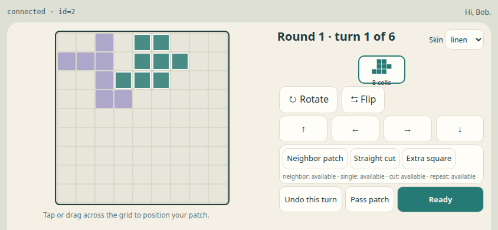

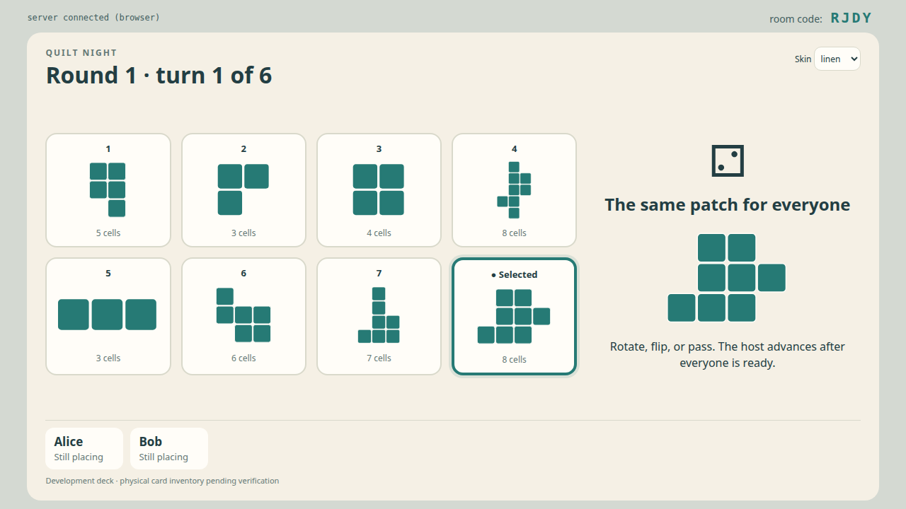

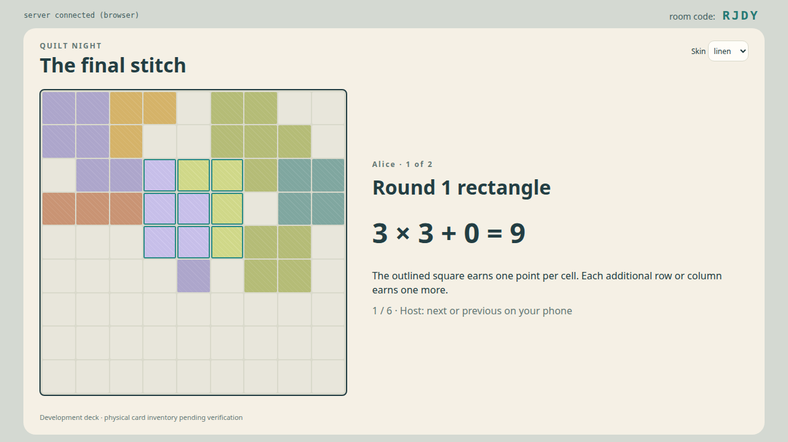

## Screen mockups

These are review mockups, not implemented game screens. Card silhouettes
are illustrative, pending the verified card inventory. The QR block is a
placeholder. The score example is internally consistent: 9 + 17 + 37 − 36 = 27.
The HTML version lets you enlarge each image and step through score counting.

### TV lobby

Room joining and player readiness are visible across the room.

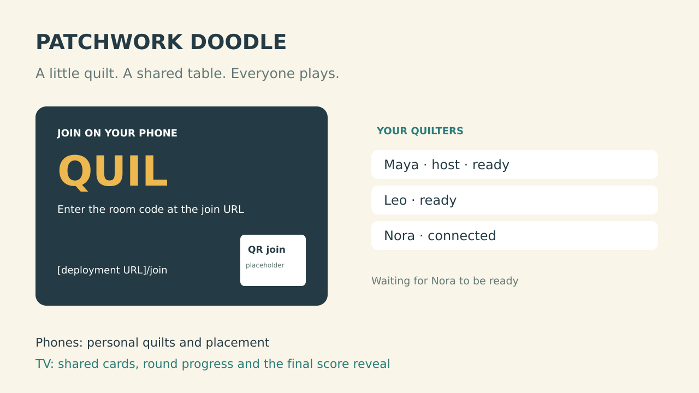

### Shared cards on Chromecast

Keep the whole circle visible, highlight the token's card, enlarge the current
patch, and identify who is still placing. Adjacent cards remain visible for
the neighbor special action.

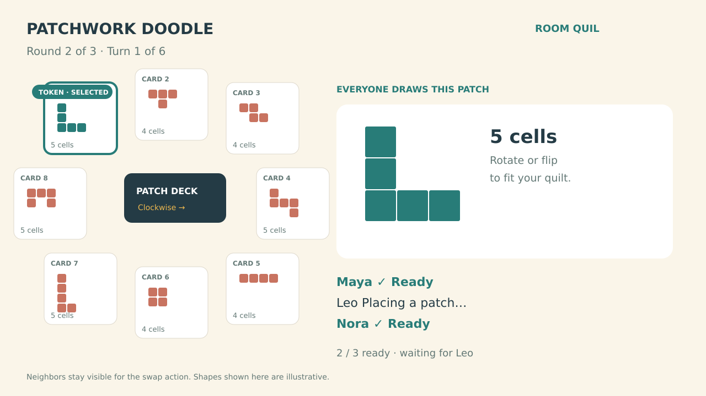

### Phone placement in portrait

The 9×9 quilt, draft outline, rotate/flip controls and special actions stay
together. Gold cells are the current editable preview; teal cells are already
committed. Confirmation is a clear, separate action.

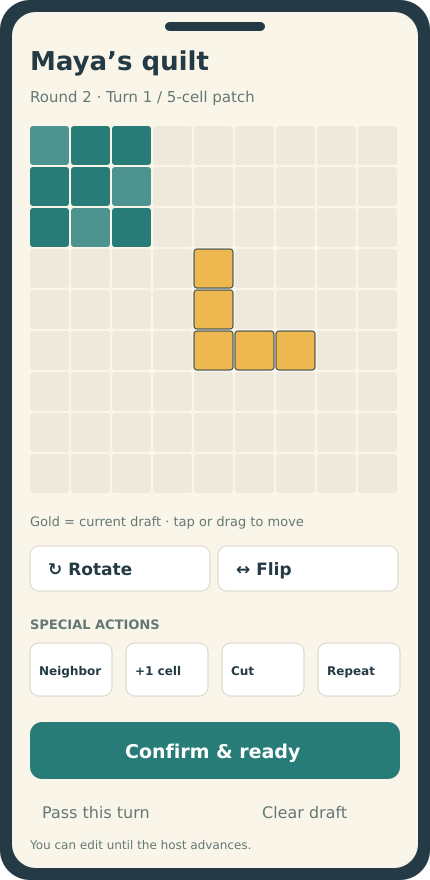

### Phone placement in landscape

Offer both orientations with the same controls and rules. Landscape gives
the quilt more room alongside the patch preview and action panel; portrait
keeps the quilt above the controls for comfortable upright use. Neither
orientation is required. Switching orientation preserves the selected card,
rotation/reflection, anchor, special-action draft and ready state.

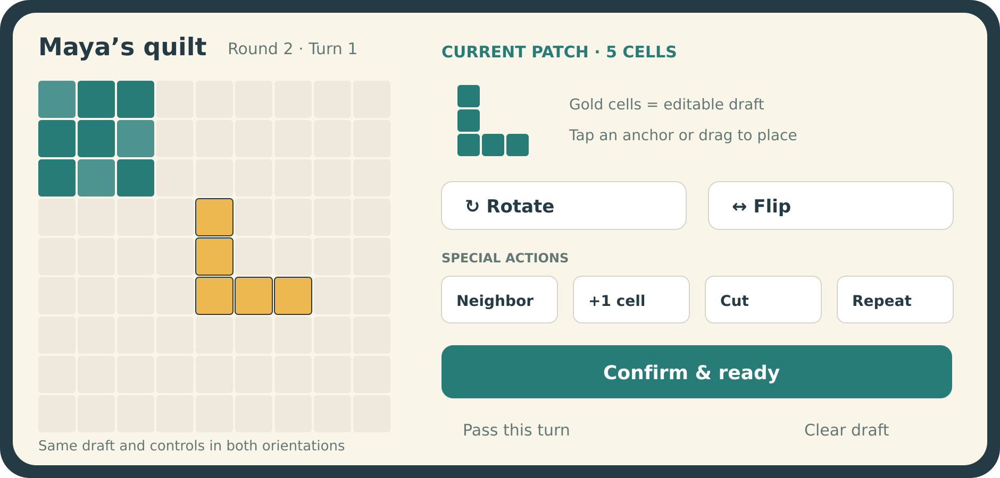

### Final turn on Chromecast

The final turn presents three shared choices and explicitly says there is
no die roll. Everyone can choose the same card.

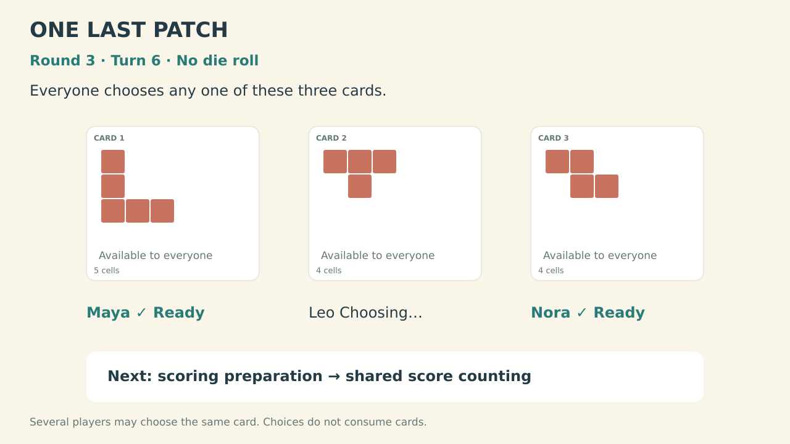

### Score counting for everyone

This frame shows Maya's third-round rectangle: a 6×6 square plus one extra
column. Earlier round scores come from their saved board snapshots, then
the final quilt's 36 empty cells are deducted. Present one quilt at a time
before revealing the shared standings.

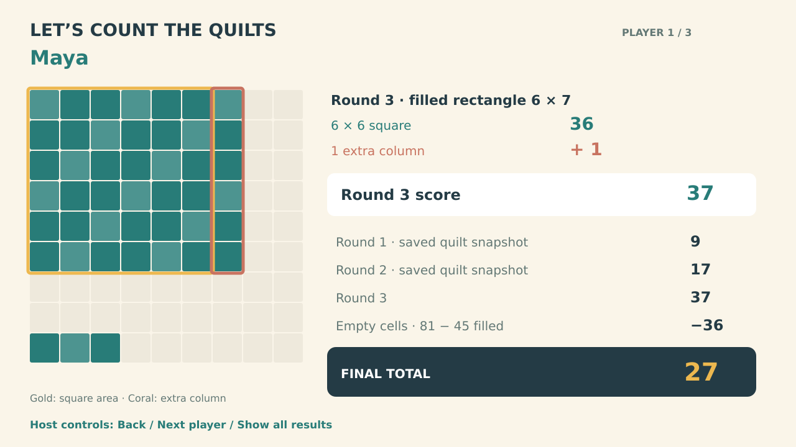

## Design diagrams

### Screens and authority

The server determines cards, validates moves and records scores. Phones send
placement intent; Chromecast presents the shared state and scoring frames.

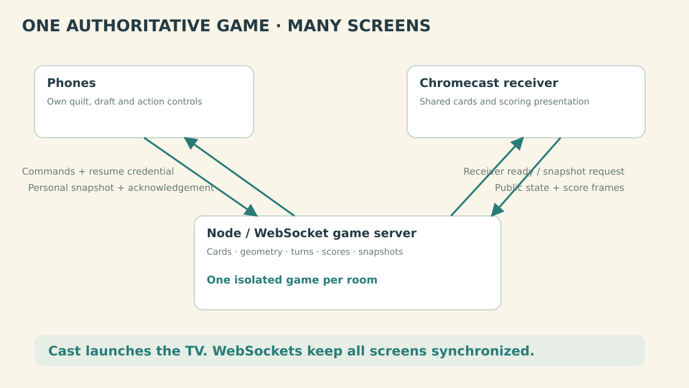

### Game and scoring flow

Normal turns loop through selection and placement. Every sixth turn opens
scoring preparation before recording the result. Rounds one and two resume
play; round three leads to the TV ceremony and results.

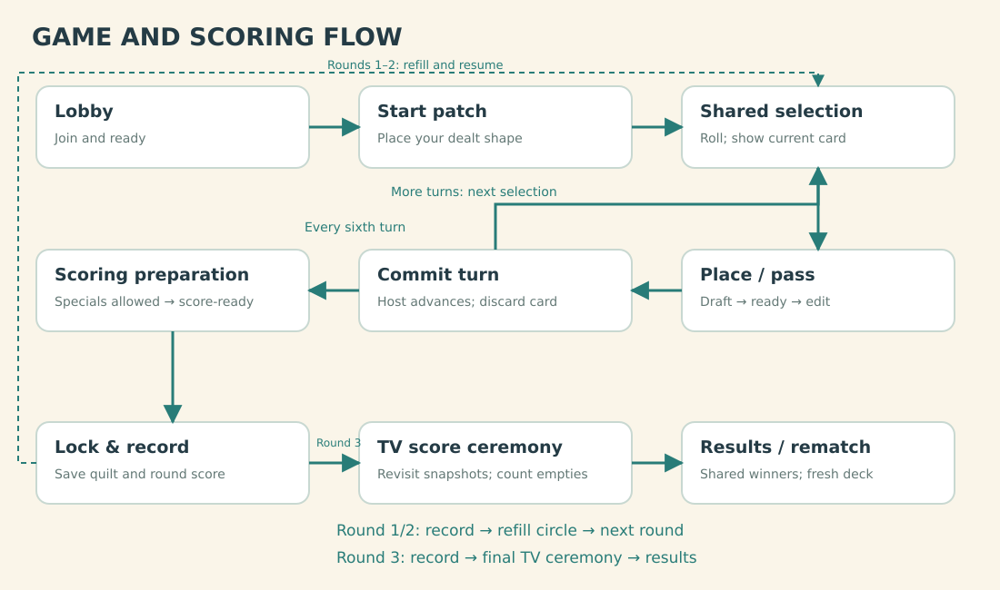

## Research and rules baseline

The [digital-platform research](research/digital-platforms.md) found official
adaptations of original Patchwork on Steam/mobile/BGA, but no verified
standalone official Doodle app. Original Patchwork’s rules are not the target.
Use [Lookout’s Doodle page](https://www.lookout-spiele.de/en/games/patchworkdoodle.html)
and the [official English rules](rules/patchwork-doodle-official-rules-en.pdf),
archived from the [Asmodee-hosted PDF](https://cdn.svc.asmodee.net/production-asmodeeca/uploads/2023/07/en_patchworkdoodle.html_Rules_PatchworkDoodle_EN.pdf).

Rule baseline, from PDF pages 2–8:

- A 9×9 quilt starts with a randomly dealt seven-cell patch.
- Three rounds have six simultaneous turns each. Eight cards start the
  circle; the die advances the token by 1–3. Everyone may use the selected
  shape, rotating/reflection allowed, with no overlap or overhang. Passing
  is allowed; adjacency is not required.
- Discard the token’s card after everyone finishes. Between rounds, carry
  two cards forward and add six. On the final turn, each player chooses
  freely among the three remaining cards, without rolling.
- One-use specials select a neighboring card, fill one cell, cut the patch
  once into two pieces and keep one, or repeat another special. Specials
  can also be used after passing and during scoring.
- Each round scores a filled rectangle: its largest square’s area plus one
  per extra row/column. Sum three scores, subtract empty cells, share ties.

Important verification work before the rules engine: clarify special-action
combinations, neighbor choice at the final turn, repeat-action semantics and
the scoring-window cutoff. Document these against the complete rulebook,
examples and any publisher FAQ rather than inventing restrictions.

The PDF contains examples, not a complete usable inventory of every card.
Obtain and verify all 10 start cards and 30 patch cards from a reliable
component reference before declaring a faithful deck complete. Request a
component scan/photo only if available publisher materials are insufficient.
Store card IDs and normalized cell coordinates with provenance; draw original
UI artwork from those shapes rather than copying card scans into the game.

## The living-room experience

| Moment | Chromecast | Player’s phone |
| --- | --- | --- |
| Join | QR/join URL, room code, names and readiness | Name entry, ready control; host starts |
| Starting patch | Shared instructions and placement status | Own dealt patch, orientation controls, preview and confirmation |
| Turn begins | Die result, token movement, active card and full remaining circle | Selected shape and legal special-action choices |
| Drawing | Large current shape, round/turn indicator and who is ready | Own quilt, movable preview, rotate/flip, special controls, confirm/pass |
| Round scoring | Filled-rectangle highlights and everyone’s round score | Last chance for eligible scoring-time specials, then score-ready |
| Final counting | Each quilt, historical scoring rectangles, empty-cell deduction, totals and winners | Same personal breakdown; host controls TV pace |
| Rematch | Shared results remain until host starts again | Ready for another game |

Cards are a shared reference, not a drafting market where one player’s pick
removes an option from other players. Keep the neighboring options visible
for special actions. Display each card’s silhouette and cell count, and make
the current selection unmistakable. In the final turn, label all three cards
as freely selectable and show that there is no die roll.

The host has a “Roll / next turn” control after everyone is ready. All
players place simultaneously; there is no active-player-first selection.
Suggested default: manual host advancement, with optional automatic advance
only after a later usability review. No turn timer or forced pass by default.

The phone supports portrait and landscape throughout joining, placement,
scoring and rematch. Use the available viewport dimensions to arrange the
quilt and controls; do not require browser orientation locking. Landscape
is likely preferable for focused placement, while portrait remains a complete
interface for players holding their phone upright. Verify this with real
phone interaction in Phase 2 rather than treating it as a settled usability
result.

The phone uses a snap-to-grid placement preview, not precision freehand
drawing. Tap an anchor cell or drag the shape; rotate and flip with explicit
buttons. A player may adjust the current preview freely. Show why an invalid
preview cannot be confirmed. Keep pass available even when a shape fits.
Patterned fills preserve patch boundaries and make occupied cells unambiguous.

Confirmation marks the player ready for the shared turn boundary. Permit
“Edit current turn” while that boundary is still open; revision commands
replace the player’s staged result, not previous-turn cells. When the host
advances, commit everyone’s staged result atomically and discard the selected
card. An edit racing with advancement is either accepted first or rejected
with the committed snapshot. Clearly label the moment a turn becomes final.

## Shared score counting

Scoring is a core TV feature, not merely a number at the end of the phone UI.

At each round boundary, enter an explicit scoring preparation phase. Players
can use eligible remaining specials, inspect the resulting quilt and mark
score-ready. The host then locks scoring. The server finds the highest-value
fully filled rectangle and records its coordinates, dimensions, calculation
and quilt snapshot. Selecting the best rectangle automatically is a proposed
convenience; tied rectangles use a stable deterministic choice for display.

Show the intermediate score for every player on Chromecast, with a highlighted
square and the extra rows/columns that contribute to the score. Preserve the
quilt; the next round builds on it. Save each round’s board snapshot so the
final TV explanation never recalculates an earlier score on the larger final
quilt.

After the third scoring preparation and lock, freeze gameplay and start a
shared final ceremony in seating order:

1. Show one player’s quilt at a time, with their name.
2. Revisit the three recorded round snapshots, outlining each scored rectangle
   and showing the square contribution plus the extra strips.
3. Build the subtotal visibly as round 1 + round 2 + round 3.
4. Highlight the empty cells on the final quilt and count the deduction.
5. Reveal the final total and add it to the shared results table.
6. After all players, reveal rankings and celebrate all tied winners.

Provide host Next/Back/Show all controls, generous automatic pacing as an
option, and reduced-motion presentation. Animation never changes scores.
Store the ceremony cursor so receiver reconnect resumes the same presentation.
Phones receive final results immediately; the TV reveal is presentation, not
a gameplay dependency. A disconnected player’s committed quilt still counts.

## Rules engine and data model

Separate geometry, scoring and state transitions from UI. Each game has a
stable game ID, shuffled deck, circle order/token position, round/turn,
players, staged moves, remaining specials and recorded scoring snapshots.
Each patch is a set of integer cells; placement includes card ID, orientation
and anchor. Keep patch identity for rendering and occupancy for validation.

The server owns randomness, card availability, legal moves, action consumption
and scores. Model die faces as 1,1,2,2,3,3. Test clockwise selection after a
discard and round rebuilding explicitly, including token wraparound. Track
the initial deal independently from the shared patch deck.

For scissors, generate straight horizontal/vertical grid-line cuts that leave
exactly two connected pieces; offer the two resulting pieces for selection.
Reject arbitrary cropping, diagonal cuts and cuts producing three pieces.
Validate action combinations against the chosen rule interpretation, including
unused-action balances and occupancy after every step. UI previews and server
validation use the same pure geometry functions, while server validation is
always authoritative.

For scoring, enumerate all fully occupied rectangles on the small board and
evaluate `min(width,height)^2 + abs(width-height)`. Use a prefix-sum occupancy
table to check each candidate. Store the winning rectangle and arithmetic,
then calculate the final score from stored round scores minus final empty
cells. Verify this independently with hand-worked board fixtures.

## Integration with the existing platform

Keep the project at `party-games/games/patchwork/`; expose the display name
“Patchwork Doodle” and launch it with `WF_GAME=patchwork`. Proposed files:

```text
patchwork.js                per-room game state machine
geometry.js                 orientations, fit checks and valid cuts
scoring.js                  rectangles and score breakdowns
cards/base.json             verified start/patch shape inventories
client/controller.js/.css   phone interface
client/receiver.js/.css     TV cards, coordination and scoring ceremony
test/                       geometry, scoring and room/protocol tests
```

Use game-prefixed command/snapshot types. Commands include game ID, turn or
scoring-window ID, revision and action ID. Acknowledge retries without applying
them twice. Reject obsolete commands with a current snapshot. Public messages
contain shared cards, readiness and committed score displays; personal
snapshots carry a player’s own board and staged placement. Publish quilts to
the TV when scoring needs them; never leak uncommitted previews.

Audit and extend the actual existing platform, without depending on unfinished
Keer op Keer changes:

- Establish the host-launch/room-binding flow. Current phone entry expects a
  room code while a fresh receiver creates a room. Ensure host and TV join
  the same room, then show a QR code for everyone else.
- Add a receiver-ready/snapshot request after mounting, and reconnect with
  backoff to the same room. Current receiver closes without reconnecting.
- Preserve a game seat beyond the existing 20-second phone grace; use a
  server-issued resume credential to restore the correct player. Keep these
  settings specific to this game unless another game explicitly adopts them.
- Expose presence, receiver connectivity and host handover. Pause at a shared
  boundary when a required player is missing. Let the host explicitly retire
  an absent seat; retired seats stop blocking turns and remain in results
  marked withdrawn, outside winner eligibility.
- Lock the roster at start; new players wait for rematch. Resume board,
  special balances, staged submission and scoring/ceremony position after
  phone or receiver refresh. Pause advancement while the TV is disconnected.

The first version recovers client connections while the server remains alive.
Server restart ends the match with a clear message; persistent saves are
outside initial scope. Limit abandoned-room retention and remove stored
credentials/snapshots when the room expires.

## Original app icon and launcher artwork

Card patch blocks use orange (`#e58b32`) on the phone and shared TV display
across all skins. The card fill is independent of the UI accent and quilt-board
colors. This change is implemented in the shared patch style.

Create an original quilt-inspired icon for the app before release, replacing
the current plain development banner. Use a bold, recognizable patch motif
that reads at small sizes and works across skins. Keep it independent of
publisher branding and community artwork; avoid text that depends on an
unconfirmed commercial name. Review the design before treating it as final.

Prepare Android adaptive-icon foreground/background layers and a monochrome
variant, app-store artwork, and a matching Android TV launcher banner. Preserve
editable source artwork and export the required assets during packaging. Check
cropping and legibility on the actual TV launcher and phone home screens.
The first original raster icon is now generated and packaged for the phone
browser favicon/touch icon and Android TV application icon. Its source and
generation prompt are archived under `assets/icons/`; this is a review draft.
Adaptive layers, monochrome variant, store exports and
phone home-screen legibility checks remain pending. The revised
icon uses exclusively orthogonal square-grid patches; the diagonal draft was
rejected. A matching 320×180 titled TV launcher banner is now generated and
packaged, replacing the plain banner placeholder.

Google TV retained the rejected diagonal icon after reinstalling version 0.1,
despite verification that the installed APK contains the new icon pixels.
Version 0.2 now uses an explicit round icon and a fresh launcher alias/resource;
its install/launch check passed. Will verified the refreshed TV launcher icon.

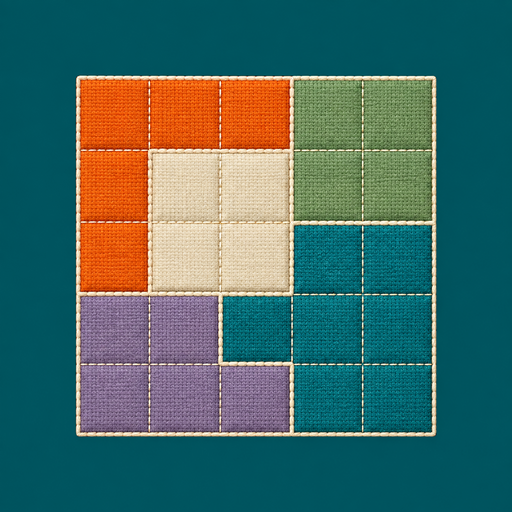

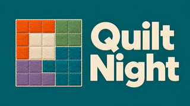

## Implementation phases

| Phase | Deliverable | Exit condition |
| --- | --- | --- |
| 0 — Rules, components and launch feasibility | Verified card inventory, special-action rulings, phone/TV wireframes, Cast hosting/app-ID audit and coordinator launch route | Complete data provenance and reviewed rule interpretations; a minimal receiver and host reach one room through an owned device session |
| 1 — Geometry and scoring | Pure orientation, placement, cutting and rectangle-scoring modules | Meaningful fixtures prove rotation/reflection, overlap/edge rejection, valid cuts, irregular filled areas, intermediate snapshots and final penalties |
| 2 — Phone placement prototype | Portrait and landscape layouts, start patch, main shape preview, rotate/flip, specials, pass, edit/ready and scoring preparation using fixtures | Small-phone users can place/correct patches and understand cuts in both orientations; rotating during a draft preserves all selections and neither layout hides controls |
| 3 — Complete browser multiplayer | Per-room plugin, synchronized card circle, all 18 turns, round rebuilding, final-choice turn and solo/multiplayer rules | Seeded one-, two- and six-player playthroughs finish correctly; stale/duplicate messages, staged edits and room isolation are verified |
| 4 — TV cards and score ceremony | Large silhouettes, token movement, readiness, all-player boards after every turn, intermediate scoring and final counting with replayable highlights | Every normal TV state fits the actual CSS viewport with six long names in every skin; physical captures cover all score contributions; recovery/error states and ceremony reconnect are verified |
| 5 — Recovery and real Chromecast | Launch/QR flow, longer seat retention, pause/host transfer and physical sessions on both dedicated devices | Android and iPhone phone controllers complete games; disconnect/refresh/rematch cases preserve state; TV evidence proves shared scoring |
| 6 — Polish and release preparation | Original app icon and TV banner, guided first round, accessible colors/patterns, touch/focus refinement, performance checks and usage docs | Required tests pass and a fresh-user playthrough succeeds; a versioned release is prepared for review before publishing |

Track phase completion against the exit conditions above. The Android TV
launcher route and normal-game TV presentation now have physical evidence.
Physical-phone compatibility, Android 12, recovery/error-state captures and
Google Cast sender launch remain open device gates. Card/rule verification and
commercial release prerequisites remain separate from prototype playability.

## Repeatable automated playthrough

`task patchwork:playthrough` starts a separate local server on a free port,
plays the complete game through two phone UIs and the TV display, checks both
phone orientations and refresh recovery, and saves screenshots and logs in a
printed `docs/diagnostics/patchwork-playthrough-*` directory. The server is
stopped after success or failure. `HEADED=1` shows the browser windows;
`SLOW_MS=...` adjusts pacing, `OUT=...` selects the archive, and `ORIGIN=...`
uses an existing server. The command fails on failed assertions.

`task patchwork:playthrough:tv` defaults to the current temporary HTTPS development
host; `ORIGIN=https://your-game-host` overrides it. The command builds/freeze-checks
both APK variants before submission, archives web-source hashes, allocates
through the shared coordinator, plays the full game on the TV, downloads
evidence, and restores/checks the ordinary play build. The hosted server must
already be running. Device cleanup stays inside owned sessions. The automatic
controllers run inside the TV session; each autoplay game randomly chooses
2–6 players and logs the chosen count. Its owned check lasts 180 seconds to
allow six players' full scoring ceremony. Physical phones still need separate
tests. Watcher interruption leaves the coordinator job running; follow the
job ID saved in the submission log.

### All-player board overview after every turn

Both regular play and autoplay must show each player's card—their 9×9 quilt
board—together after **every** committed turn. Use a single TV screen with
all active players visible at once; do not page through individual players.
Label every board and show the completed round/turn. Show the actual committed
placements, including unchanged boards after a pass, without exposing drafts.

In regular play, the host continues from their phone after everyone has seen
the overview. In autoplay, hold the same overview for four seconds and then
continue automatically. This also applies after the last placement turn of a
round, before scoring preparation, and after the final placement before the
final round's scoring flow. The usual shared card pool returns for the next
placement turn. Intermediate round scores and the final TV counting ceremony
remain separate presentations.

Implement this as a shared server-authoritative turn-result phase with committed
board snapshots. Pause progression during the overview and preserve it across
receiver/phone reconnects. The host's Continue command and autoplay's delayed
Continue use the same phase/stage validation. This is implemented as
`TURN_RESULTS`: committing a placement publishes all committed boards and
holds the completed round/turn; Continue starts the next placement or scoring
preparation. Draft edits are rejected in this phase. The ordinary browser game
passes all 18 overviews, host-only Continue and receiver/phone refresh checks,
including a visible Continue button in landscape. Autoplay passes full games
at every count from 2–6 using the same shared phase. Rule tests also cover
one-player snapshots, passes, stale commands, host changes and disconnects.
The [gallery](../../../docs/diagnostics/patchwork-tv-review/index.html#end-of-turn)
includes six committed-board previews and all 18 regular-game turn captures.

The additional six-player physical recording job `J-2c3998a36d75` completed
and its video is archived in `docs/diagnostics/patchwork-shared-turn-results-record`.
That capture starts after the first turn. A complete six-player 1080p browser
recording, including all 18 shared turn summaries and final scoring, is archived
as `docs/diagnostics/patchwork-browser-playthrough-video/quilt-night-playthrough.mp4`.
The successful TV playthrough and ordinary-app restoration receipts are also archived.

Capture the new overview with one, two and six players, long names, passes,
every skin and both TV device viewports. Verify all boards fit without paging
and that Continue advances exactly once.

The six-player state/skin audit remains a separate presentation check:
`test/tv-state-check.py` captures public states, `test/tv-state-replay.py`
checks all three skins, and the TV recording workflow archives physical
frames for the screenshot gallery. See [launcher verification](tv/README.md).

## Accessibility and verification

Fit the 9×9 board above the controls in portrait; place the quilt beside the
preview and controls in landscape. Both layouts must expose rotation, flip,
specials, pass, confirmation, readiness and help. Respect safe-area insets
and dynamic browser chrome; on short landscape screens, allow the action
panel to scroll while keeping confirm/pass reachable. Keep touch targets
large enough without squeezing the entire UI to fit. Preserve game/draft
state independently of layout and cancel an in-flight drag cleanly on resize.

Test portrait ↔ landscape during placement, scissors selection, scoring
preparation and waiting/ready states, including Android Chrome and iPhone
Safari. Check that resize never submits a move or consumes a special.
Preview tap and drag options on real phones before settling the default.
Make drag optional, with keyboard/focus controls and
accessible cell labels. Use borders/patterns rather than color alone. TV cards
use SVG/CSS silhouettes with reliable rotation and generous overscan margins.
Verify both pixel resolution and CSS viewport at 720p and 1080p; include the
HD device’s 960×540 CSS viewport and six-player long-name layouts. Animations
and sound are optional, not readiness cues.

Tests should catch wrong rules and state transitions rather than duplicate the
implementation. Include manually calculated score boards, cut examples from
the rules, a full seeded card progression, every action at scoring time,
repeat-action combinations, final-turn independent choices, an edit/advance
race, and reconnection after a lost acknowledgement. Run existing platform
regressions whenever shared-shell/server behavior changes.

Use coordinated device sessions exclusively, following
[the coordinator documentation](../../../docs/device-coordinator.md).
Check `task chromecast:devices` and `task chromecast:queue`; submit with the
chosen `DEVICE` or `POOL=chromecast-test`, follow `task chromecast:watch
JOB=...`, and download `task chromecast:evidence JOB=... OUT=...`.
Launch, input, capture and cleanup belong to the single owned session.
Use both Chromecast HD/Android 14 and Project Room/Android 12 devices.

The installed coordinator accepts `APP=patchwork` with the fixed Android TV
activity. Use `check` for launch/gameplay/resume and `record` for a complete
state sequence; the testing-only `--visual-check` APK drives six simulated
players inside that session. Restore the ordinary interactive build afterward.
Build/freeze APKs locally and archive web-source hashes before device jobs.
A maintained Google Cast custom-receiver launch route still needs validation.
An unavailable coordinator does not permit direct Chromecast control.

Archive owned device receipts, recordings, extracted frames and build/source
identifiers under `docs/diagnostics/`; keep browser snapshots and layout reports
in this project’s `test/evidence/`. Link both from the plan and screenshot
gallery. Extract the video sample already displayed at a state timestamp;
Android screenrecord is sparse, and blindly seeking forward can select the
next state. Any diagnostic requested from Will writes to a named file, prints
the path and is read directly afterward.

## Review choices

Recommended: base Doodle only, 1–6 players, simultaneous untimed placement,
host-controlled advancement, reversible current-turn drafts until advance,
complete portrait and landscape phone interfaces, automatic best-rectangle
scoring, and a fully shared TV score ceremony.
The phone placement design and special-action rulings are Phase 0 review
items. After Will approves this plan, implement phases in order. Public
release branding/assets and deployment are separate release decisions.

Archived English rulebook SHA-256:
`e17c43aee47afe5f449d49b73b07e4bc0ac2ffdee5a6aa9d8607a9de9cf05f12`.
