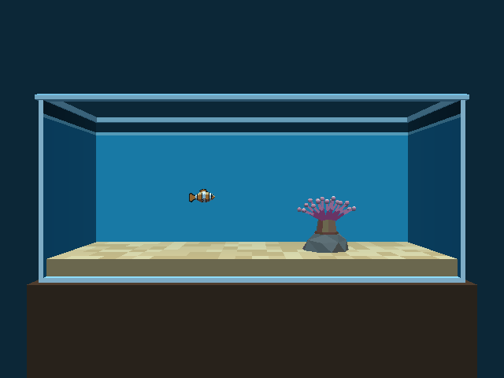

# Aquarium — 55 gal acrylic tank, one clownfish, one anemone

A 55 gallon acrylic tank (48 × 13 × 21 in, ½ in walls) on a stand in a dark room. It has sand, a rock, a bubble-tip
anemone, and an ocellaris clownfish you swim. Swim into the anemone and the camera closes in on it. The plan, its
evidence, and the verification record are in
[`docs/plans/2026-09-30-aquarium-level.md`](../../docs/plans/2026-09-30-aquarium-level.md).




**Status (2026‑09‑30): Phase 3.** The canonical clownfish from [`clownfish.py`](clownfish.py) is the player, with
its idle animation. It has swim, depth and dart controls, the anemone close-up camera (camshot B) with a hysteresis
zone, and a touch profile. Phase 4 (anemone sway, optional) has not started.

## Build and run

```
task aquarium-level          # Blender → aquarium.lev → aquarium.iff + aquarium-standalone.iff (keyboard/gamepad)
task aquarium-touch-level    # the touch profile → wflevels/aquarium_touch-standalone.iff (git-ignored)
task run-aquarium            # wf_game on wflevels/aquarium-standalone.iff (deps: ensure-build, aquarium-level)
python3 -m pytest tests/test_aquarium_level.py tests/test_aquarium_idle.py      # regression guards
python3 wflevels/aquarium/run_aquarium_checks.py                  # plan steps 11, 12, 13, 15 over the debug bridge
python3 wflevels/aquarium/run_aquarium_checks.py --profile touch  # plan step 14 (logic, injected buttons)
```

`task aquarium-level` needs the `wf_blender` add-on installed. A second run is a no-op. The profile is chosen at
build time (`AQUARIUM_PROFILE=keyboard|touch`, like the condo's `CONDO_CAMERA_PROFILE`). Run the touch build with
`LD_LIBRARY_PATH=engine/libs engine/wf_game -Lwflevels/aquarium_touch-standalone.iff`.

`run_aquarium_checks.py` runs the already-built level **paused** under `-rate20` and steps it one tick at a time.
Input is a sticky injected joystick value on every tick (0 when nothing is held), so keys typed on the desktop
cannot reach the fish. It checks the joystick the engine saw against what it injected on every tick and prints
`run isolation: CLEAN`. It uses `engine/wf_game`, falling back to the main checkout's (`WF_GAME=` overrides it), and
bridge port 7811 (`WF_BRIDGE_PORT=`). Screenshots go to `~/tmp/aquarium-phase3` (`OUT=`). `--trace-sand` prints
every tick of a swim along the sand into the rock.

## Controls

Keyboard / gamepad (the default build):

| Input | Action |
|---|---|
| ← / → | Swim left / right. The fish turns to face the way it swims (the rig turns the visible parts over 0.35 s) |
| ↑ / ↓ | Swim up / down |
| B (`2`) / C (`3`) held | Swim toward / away from the glass |
| A (`1`, space) | Dart: 6.1 m/s along the way the fish faces for 0.15 s, then glide (≈ 3.6 m in all) |
| release | Glide to a stop (air drag, × 0.9 per tick, ≈ 1.4 m from full speed) |
| nothing for 0.35 s | The idle animation fades in: bob, sway, tail beat, pectoral flutter, dorsal ripple |

Touch (phone landscape, `task aquarium-touch-level`: a D-pad plus A and B only, as in the plan's narrow mockup):

| Input | Swim mode (start) | Depth mode |
|---|---|---|
| D-pad ← / → | swim left / right | swim left / right |
| D-pad ↑ / ↓ | swim up / down | swim away from / toward the glass |
| A tap | → Depth mode | → Swim mode |
| B tap | dart | dart |

There is no on-screen indicator of the touch mode yet. The mode is in mailbox 701 (`aq-mode`). The touch
profile's logic is verified with injected buttons (plan step 14); it has not been run on a phone.

Swimming uses the Phase 1 values unchanged. While a direction is held the script writes ±3.048 m/s (12 in/s × 10) to
that axis, and on release it writes nothing, so the air drag glides the fish. Cruise is 2.743 m/s. The script never
writes the Player's `ROTATION_C`: the rig owns the visible heading.

**Clamps (the level's, from the fish's `extents()`):** |x| ≤ 5.378 m (the 0.528 m tail-tip reach plus 0.25 in off
an end wall, whichever way the fish faces), |y| ≤ 1.350 m (pectorals 0.25 in off the back wall and the front
collider), z ≤ 4.461 m (dorsal plus bob 0.25 in under the water line). The floor clamp, z ≥ 0.980 m, keeps the
capsule 0.15 m over the sand, so Jolt never treats the fish as standing on it (see *Findings*). The shell and the
invisible front collider are the physical backstop.

## Cameras

| Camshot | Where | When |
|---|---|---|
| A `cs_front` | (0, −11, 2.667) m looking at the tank's centre: the whole tank | everywhere else |
| B `cs_anemone` | (2.5, −2.2, 1.75) m, 0.55 m outside the glass, looking at `LookB` | the fish is within 2.2 m of the zone centre (2.5, 0, 1.771) |

The Director switches them (`aq-camera-tick`, after `fish-rig-tick`). It selects B when the fish comes within 2.2 m of
the zone centre, and returns to A only when the fish is more than 2.5 m away, so the shot cannot flicker at the edge
(measured: in at 2.14 m, out at 2.55 m). This level is in bungee mode, so the camera flies between the shots on its
spring instead of cutting, and the 10‑unit slew clamp does not apply. `LookB` is a Mass-0 platform the Director moves
each tick, 35 % of the way from the anemone toward the fish, so a fish at the zone's edge stays in frame. Both cameras
are outside the tank, where their boxes never meet the Mass‑1 fish (a bungee camera climbs while it overlaps one).

## What is modelled

All sizes come from [`aquarium_constants.py`](aquarium_constants.py) at `WORLD_SCALE = 10`, so 1 in = 0.254 m. The
origin is the centre of the tank's footprint, and z = 0 is the outer base. `clownfish.py` takes the scale and the
fish's 3.5 in length from there.

| Actor | What it is |
|---|---|
| `Player` | The clownfish's **invisible** collision hull: a `Physics` actor with no gravity, a copy of the body mesh, and an authored symmetric box ±0.361 × ±0.125 × ±0.195 m (capsule radius 0.125). It spawns at (−1.6, 0, 2.4) m (the body centre). Its script is the swim controller ([`aquarium_swim.fth`](aquarium_swim.fth)) around the fish's idle sense |
| `clownfish-body`, `-tail`, `-dorsal`, `-pec-near`, `-pec-far` | The visible fish (0.889 m): five Mass-0 anchored platforms. The Director poses them every tick from the Player's position (`fish-rig-tick`) |
| `tank-shell` | Bottom, back and two end walls as one Mesh `statplat`, open at the front and top. Pale-cyan outer faces, brighter front edges. The inner faces are water-blue below the water line (the back film), a light band at the line, and dark above it |
| `tank-front-collider` | Invisible slab in the front-glass plane. Plan B has no front face, so this keeps the fish in |
| `tank-rim` | Chamfered ring round the top. It overhangs the walls, so no rim face is coplanar with a wall face |
| `sand` | 2 in deep, top at 2.5 in; 24 × 6 flat quads in three shades |
| `rock` | Low-poly convex hull, 1.7 × 1.3 × 0.55 m, with a flat top at x +2.5 m. Solid |
| `anemone` | The bubble-tip's base disc, faceted column and oral disc. Solid (`statplat`) |
| `anemone-tentacles` | 17 two-tone tentacles with bulb tips, about 7.5 in across, in a back set (y +0.36 m) and a front set (y −0.36 m). A Mass-0 anchored platform with **no Jolt body**, so the fish can swim in among them from any depth; one between the sets is overlapped by the front set by plain depth |
| `anemone-zone` | Invisible `target` carrying the ±2.2 m zone box round the anemone; its centre and radius are the Director's zone |
| `LookB` | Invisible Mass-0 platform: camshot B's aim point |
| `stand`, `room-backdrop` | Dark-brown stand and a navy wall, so the camera never sees the void |
| `SunLight`, `AmbientLight` | Directional 0.72, from above (65°) on the camera side; cool ambient (0.36, 0.43, 0.50) |
| `cs_front`, `cs_anemone` + `Camera` + `LookAt` | Camshots A and B (above). Fog `0x0d5f7a`, 6 → 40 m. The `Camera` has a ±0.2 m box |

Mailboxes: 600–639 belong to the fish (`clownfish.py` `MAILBOXES`), and 700–719 to the level (`aq-prev`, `aq-mode`,
`aq-dart-t`, `aq-dart-req`, `aq-in-b`, `aq-dx`/`dy`/`dz`, `aq-vx`/`vy`/`vz`).

## What is not modelled

- **No front pane, and nothing translucent (Plan B).** The engine drops texture alpha (plan § Phase 0 verdict), so a
  pane would draw opaque and hide the fish. The water is carried by the fog, the water-coloured inner faces and the
  water-line band. Plan A, a translucent pane, waits on its own engine TODO.
- The anemone does not sway (optional, Phase 4). There is no water surface, no lid, no bubbles and no caustics.
- The touch profile has no on-screen mode indicator and has not been run on a phone.

## Findings worth keeping

- **Jolt's character is a walker, even with no gravity.** Any contact within ≈ 0.12 m under the capsule counts as
  ground: 0.02 m padding plus the 0.1 m predictive distance, on slopes up to 80°. Parked 0.06 m over the sand, the
  fish was "standing": it had ground friction and walk-stairs, and pushed into the rock it stepped up 0.36 m in one
  tick. Because velocity is inferred from the position change, that step then flew it up at 7 m/s. Two script fixes:
  the floor clamp keeps the capsule 0.15 m over the sand, and **no uncommanded acceleration** (`aq-no-kicks`). Any axis
  that physics made faster than the script left it last tick is put back to that speed. The glide is untouched. What
  remains: pushed into the rock or the anemone column, the fish slides up and over it, with one 0.4 m walk-stairs step
  at the column and about 0.3 m sideways.
- **A clamp at its own limit needs a tolerance.** Positions are 16.16 fixed point, so a position written at `ZMIN`
  read back just under it. The floor clamp then zeroed the speed on every tick, and the fish could not rise off the
  floor. The clamps now compare with ±1 mm.
- **Colliding tentacles made hosting impossible to aim.** With the tentacles solid, the real hull entered the crown
  only within |y| < 0.035 m of the gap (0.28 m to the bulbs, minus 0.125 capsule, 0.02 padding and 0.1 predictive).
  One tick of Y input glides about 1.4 m, so a player cannot aim that closely. The tentacles are now a separate
  non-colliding actor, and the base and column stay solid.
- **The light aim is mirrored here.** The doc's recipe for outward-wound geometry (`B = −alt`, `C = −90°`) left every
  face at exactly the ambient term in the first capture. This level uses `B = +alt`, `C = +90°`, which is
  `wf_light_aim`'s form. As `docs/level-building.md` says: verify every light with a capture.
- **The `Player` must come before `tank-shell`,** and the parts follow it. The regression test asserts this, because
  Jolt ignores a static body whose bbox already encloses the character.
- **Every snowgoons infrastructure actor imports at Mass 75.** A Mass > 0 bbox is solid to the Player, and `LookAt`
  sits at the tank's centre, in the water. Every one of them is Mass 0 here.
