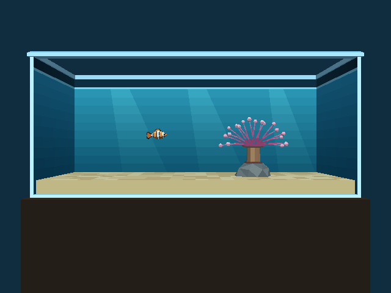
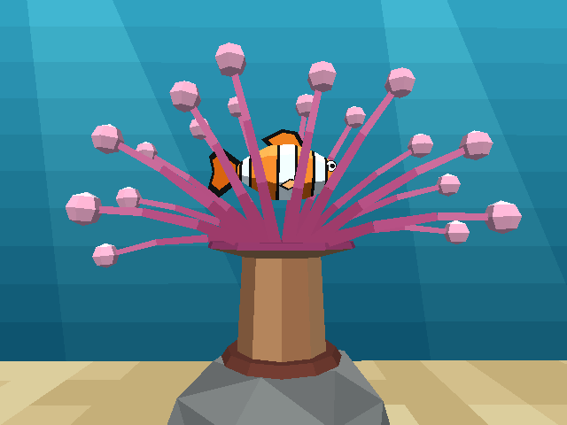

# Aquarium — 55 gal acrylic tank, one clownfish, one anemone

A 55 gallon acrylic tank (48 × 13 × 21 in, ½ in walls) on a stand in a dark room. It has sand, a rock, a bubble-tip
anemone, and an ocellaris clownfish you swim. Swim into the anemone and the camera closes in on it. The plan, its
evidence, and the verification record are in
[`docs/plans/2026-09-30-aquarium-level.md`](../../docs/plans/2026-09-30-aquarium-level.md).





**Status (2026‑09‑30): Phase 4.** The canonical clownfish from [`clownfish.py`](clownfish.py) is the player, with
its idle animation. It **steers and swims only along the way it faces**, with a burst-and-coast gait, a tail beat set
by its speed and pectorals that scull, beat, flare and fold. The 12 in anemone sways in six clumps, the water has a
gradient and light shafts, and the anemone close-up camera (camshot B) switches in on a hysteresis zone. There is a
touch profile. The plan's § Phase 4 verdict lists what is still open.

## Build and run

```
task aquarium-level          # Blender → aquarium.lev → aquarium.iff + aquarium-standalone.iff (keyboard/gamepad)
task aquarium-touch-level    # the touch profile → wflevels/aquarium_touch-standalone.iff (git-ignored)
task run-aquarium            # wf_game on wflevels/aquarium-standalone.iff (deps: ensure-build, aquarium-level)
python3 -m pytest tests/test_aquarium_level.py tests/test_aquarium_idle.py      # regression guards
python3 wflevels/aquarium/run_aquarium_checks.py                  # plan steps 11, 12, 13, 15 over the debug bridge
python3 wflevels/aquarium/run_aquarium_checks.py --profile touch  # plan step 14 (logic, injected buttons)
python3 wflevels/aquarium/run_aquarium_checks.py --sway          # plan step 16: the anemone sway trace
python3 wflevels/aquarium/run_aquarium_checks.py --cost [IFF…]   # plan step 18: ms per frame, this build vs others
python3 wflevels/aquarium/run_aquarium_checks.py --steer         # plan step 20: steer-and-swim traces + motion strips
task video-aquarium          # real-time demo video → ~/tmp/aquarium-phase4/motion-demo.mp4 (scratch; reference copy: tests/recordings/aquarium_phase4_motion_demo.mp4)
python3 -m pytest tests/test_codemagic_aquarium_parity.py                   # plan step 21: the macOS Metal-vs-GL parity step in codemagic.yaml (static; the Metal half runs on Codemagic)
```

`task aquarium-level` needs the `wf_blender` add-on installed. A second run is a no-op. The profile is chosen at
build time (`AQUARIUM_PROFILE=keyboard|touch`, like the condo's `CONDO_CAMERA_PROFILE`). Run the touch build with
`LD_LIBRARY_PATH=engine/libs engine/wf_game -Lwflevels/aquarium_touch-standalone.iff`.

`run_aquarium_checks.py` runs the already-built level **paused** under `-rate20` and steps it one tick at a time.
Input is a sticky injected joystick value on every tick (0 when nothing is held), so keys typed on the desktop
cannot reach the fish. It checks the joystick the engine saw against what it injected on every tick and prints
`run isolation: CLEAN`. It uses `engine/wf_game`, falling back to the main checkout's (`WF_GAME=` overrides it), and
bridge port 7811 (`WF_BRIDGE_PORT=`). Screenshots go to `~/tmp/aquarium-phase3` (`OUT=`). `--trace-sand` prints
every tick of a swim along the sand into the rock.

## Controls

Keyboard / gamepad (the default build):

| Input | Action |
|---|---|
| ← / → | Steer left / right: the fish turns toward that way (a reversal is a U-turn arc) and swims along its facing |
| ↑ / ↓ | Climb / dive: the fish tilts up to 40° (30° with a sideways direction held too) and swims forward along that pitch; never straight up or down |
| B (`2`) / C (`3`) held | Steer toward / away from the glass: it turns to face the glass (or the back) and swims that way |
| A (`1`, space) | Dart: a burst to 6.1 m/s along the way the fish faces, then the glide (≈ 3.3 m in all) |
| release | Glide to a stop along the facing with the pectorals flared (≈ 1.35 m from cruise); the pitch levels in ≈ 0.7 s |
| nothing for 0.35 s | The idle animation fades in: bob, sway, tail beat, pectoral flutter, dorsal ripple |

Touch (phone landscape, `task aquarium-touch-level`: a D-pad plus A and B only, as in the plan's narrow mockup):

| Input | Swim mode (start) | Depth mode |
|---|---|---|
| D-pad ← / → | swim left / right | swim left / right |
| D-pad ↑ / ↓ | climb / dive | steer away from / toward the glass |
| A tap | → Depth mode | → Swim mode |
| B tap | dart | dart |

There is no on-screen indicator of the touch mode yet. The mode is in mailbox 701 (`aq-mode`). The touch
profile's logic is verified with injected buttons (plan step 14); it has not been run on a phone.

**Steer and swim (Phase 4).** A fish never moves sideways or straight up or down, so the controller never writes a
velocity along a button's axis. The held buttons give a wanted direction; yaw and pitch turn toward it as damped
springs (pitch slower than yaw, a small bank into turns), and every tick the script writes speed × facing to
`XSPEED`/`YSPEED`/`ZSPEED`. Nothing else writes a velocity, and the Player's air drag is 0. The speed is
burst-and-coast: a 0.5 s cycle, a burst toward 1.3 V then a coast, averaging V = 3.048 m/s (12 in/s × 10,
3.4 body lengths/s). The tail beats at f = St·U/A for the actual speed U (St = 0.3, A = 0.2 body lengths, capped at
6 Hz so a beat is visible at 20 ticks/s) and is still while coasting; the pectorals beat at 2.4–4.6 Hz with speed
(measured for *A. ocellaris*). Sources and which numbers are verified, unverified or ours: comments in
[`aquarium_constants.py`](aquarium_constants.py) and [`clownfish.py`](clownfish.py). The script never writes the
Player's `ROTATION_*`: the rig owns the visible heading, pitch and bank.

**Limits (Phase 4: they turn with the fish).** Every tick the visible fish's box (nose 0.361 m ahead of the body
centre, tail tip 0.528 m behind, fins with their flare, dorsal and belly with the bob) is rotated by its facing, which
gives six limits for the body: 0.25 in off each end wall, the back wall, the front glass and the water line, and
0.25 in over the sand. The speed is capped at the room ahead ÷ 0.25 s, so the fish eases to a stop facing a wall; a
turn that swings the tail past a limit moves the body back inside. Near the sand and the surface a climb or dive
flattens out. The floor limit also keeps the capsule 0.15 m over the sand, so Jolt never treats the fish as standing
on it (see *Findings*). The shell and the invisible front collider are the physical backstop.

## Cameras

| Camshot | Where | When |
|---|---|---|
| A `cs_front` | (0, −11, 1.9) m, aimed level at (0, 0, 1.9): the whole tank | everywhere else |
| B `cs_anemone` | (2.5, −2.5, 2.0) m, outside the glass, looking at `LookB` (rests at (2.5, 0, 2.0)) | the fish is within 2.2 m of the zone centre (2.5, 0, 1.771) |

The Director switches them (`aq-camera-tick`, after `fish-rig-tick`). It selects B when the fish comes within 2.2 m of
the zone centre, and returns to A only when the fish is more than 2.5 m away, so the shot cannot flicker at the edge
(measured: in at 2.14 m, out at 2.55 m). This level is in bungee mode, so the camera flies between the shots on its
spring instead of cutting, and the 10‑unit slew clamp does not apply. `LookB` is a Mass-0 platform the Director moves
each tick, 35 % of the way from the anemone toward the fish, so a fish at the zone's edge stays in frame. Both cameras
are outside the tank, where their boxes never meet the Mass‑1 fish (a bungee camera climbs while it overlaps one).

## What is modelled

All sizes come from [`aquarium_constants.py`](aquarium_constants.py) at `WORLD_SCALE = 10`, so 1 in = 0.254 m. The
origin is the centre of the tank's footprint, and z = 0 is the outer base. `clownfish.py` takes the scale and the
fish's 3.5 in length from there.

| Actor | What it is |
|---|---|
| `Player` | The clownfish's **invisible** collision hull: a `Physics` actor with no gravity, a copy of the body mesh, and an authored symmetric box ±0.361 × ±0.125 × ±0.195 m (capsule radius 0.125). It spawns at (−1.6, 0, 2.4) m (the body centre). Its script is the swim controller ([`aquarium_swim.fth`](aquarium_swim.fth)) around the fish's idle sense |
| `clownfish-body`, `-tail`, `-dorsal`, `-pec-near`, `-pec-far` | The visible fish (0.889 m): five Mass-0 anchored platforms. The Director poses them every tick from the Player's position (`fish-rig-tick`) |
| `tank-shell` | Bottom, back and two end walls as one Mesh `statplat`, open at the front and top. Pale-cyan outer faces, brighter front edges. The inner faces are a 10-step water gradient below the water line (darker toward the sand) with three light shafts on the back wall, a light band at the line, and dark above it |
| `tank-front-collider` | Invisible slab in the front-glass plane. Plan B has no front face, so this keeps the fish in |
| `tank-rim` | Chamfered ring round the top. It overhangs the walls, so no rim face is coplanar with a wall face |
| `sand` | 2 in deep, top at 2.5 in; 24 × 6 flat quads in three shades |
| `rock` | Low-poly convex hull, 1.7 × 1.3 × 0.55 m, with a flat top at x +2.5 m. Solid |
| `anemone` | The bubble-tip's base disc, a 0.6 m faceted column and a flared oral disc. Solid (`statplat`) |
| `anemone-tent-back-l/c/r`, `anemone-tent-front-l/c/r` | 18 two-tone tentacles with bulb tips, 12 in across the crown, in six clumps (a back and a front row). Each is a Mass-0 anchored platform with **no Jolt body**, pivoted at its base on the oral disc, and the Director sways it (B ±4–5.5°, A ±1.2–1.5°, periods 3.05–4.75 s, each its own phase). The fish swims in among them; the front row overlaps it by plain depth |
| `anemone-zone` | Invisible `target` carrying the ±2.2 m zone box round the anemone; its centre and radius are the Director's zone |
| `LookB` | Invisible Mass-0 platform: camshot B's aim point |
| `stand`, `room-backdrop` | Dark-brown stand and a navy wall, so the camera never sees the void |
| `SunLight`, `AmbientLight` | Directional 0.72, from 40° above on the camera side (65° rendered the fish brown); cool ambient (0.45, 0.50, 0.55) |
| `cs_front`, `cs_anemone` + `Camera` + `LookAt` | Camshots A and B (above). Fog `0x0d5f7a`, 6 → 40 m. The `Camera` has a ±0.2 m box |

Mailboxes: 600–639 belong to the fish (`clownfish.py` `MAILBOXES`), 700–719 to the level (`aq-prev`, `aq-mode`,
`aq-dart-t`, `aq-dart-req`, `aq-in-b`, `aq-dx`/`dy`/`dz`, `aq-vx`/`vy`/`vz`, …), 720–739 to the anemone sway (one
phase per clump) and 740–759 to the steer-and-swim state (`aq-yaw`, `aq-pitch`, `aq-roll`, `aq-speed`, their rates,
the gait's cycle and the limits).

## What is not modelled

- **No front pane, and nothing translucent (Plan B).** The engine drops texture alpha (plan § Phase 0 verdict), so a
  pane would draw opaque and hide the fish. The water is carried by the fog, the water-coloured inner faces and the
  water-line band. Plan A, a translucent pane, waits on its own engine TODO.
- There is no water surface, no lid, no bubbles and no caustics. The light shafts are painted on the back wall.
- The touch profile has no on-screen mode indicator and has not been run on a phone.

## Findings worth keeping

- **Jolt's character is a walker, even with no gravity.** Any contact within ≈ 0.12 m under the capsule counts as
  ground: 0.02 m padding plus the 0.1 m predictive distance, on slopes up to 80°. Parked 0.06 m over the sand, the
  fish was "standing": it had ground friction and walk-stairs, and pushed into the rock it stepped up 0.36 m in one
  tick. Because velocity is inferred from the position change, that step then flew it up at 7 m/s. Two script fixes:
  the floor clamp keeps the capsule 0.15 m over the sand, and **no uncommanded acceleration** (`aq-no-kicks`). Any axis
  that physics made faster than the script left it last tick is put back to that speed. The glide is untouched. What
  remains: pushed into the rock or the anemone column, the fish slides up and over it, with one 0.4 m walk-stairs step
  at the column and about 0.3 m sideways.
- **A clamp at its own limit needs a tolerance.** Positions are 16.16 fixed point, so a position written at `ZMIN`
  read back just under it. The floor clamp then zeroed the speed on every tick, and the fish could not rise off the
  floor. The clamps now compare with ±1 mm.
- **Colliding tentacles made hosting impossible to aim.** With the tentacles solid, the real hull entered the crown
  only within |y| < 0.035 m of the gap (0.28 m to the bulbs, minus 0.125 capsule, 0.02 padding and 0.1 predictive).
  One tick of Y input glides about 1.4 m, so a player cannot aim that closely. The tentacles are now a separate
  non-colliding actor, and the base and column stay solid.
- **The light aim is mirrored here.** The doc's recipe for outward-wound geometry (`B = −alt`, `C = −90°`) left every
  face at exactly the ambient term in the first capture. This level uses `B = +alt`, `C = +90°`, which is
  `wf_light_aim`'s form. As `docs/level-building.md` says: verify every light with a capture.
- **The `Player` must come before `tank-shell`,** and the parts follow it. The regression test asserts this, because
  Jolt ignores a static body whose bbox already encloses the character.
- **Every snowgoons infrastructure actor imports at Mass 75.** A Mass > 0 bbox is solid to the Player, and `LookAt`
  sits at the tank's centre, in the water. Every one of them is Mass 0 here.
- **A blanked screen slows every run to one frame a second.** With the display in DPMS off (power management after
  inactivity), Xwayland paces a window that is on no live output at 1 Hz: the engine log shows
  `delta too large: 1.0…` on every frame, a bridge step takes a second, and `test_aquarium_idle.py`'s runtime tests
  time out (seen 2026‑09‑30 at 18:17). Results stay valid, because the level runs on a fixed tick, but wall-clock
  costs are meaningless, so `--cost` refuses to run then. Wake the screen (`kscreen-doctor --dpms on`) and hold it
  on for the run (`kde-inhibit --power --screenSaver <command>`).
- **Tentacle bulbs were most of Phase 4's frame cost.** 27 tentacles with 40-face bulbs took the level from 9.7 to
  14.7 ms per frame (`--frame-step-smoke`, this laptop's Iris Xe); with those six meshes swapped for a box it ran in
  9.1 ms, and the sway itself cost about 0.1 ms. The crown is now 18 tentacles with 24-face bulbs (plan step 18).

