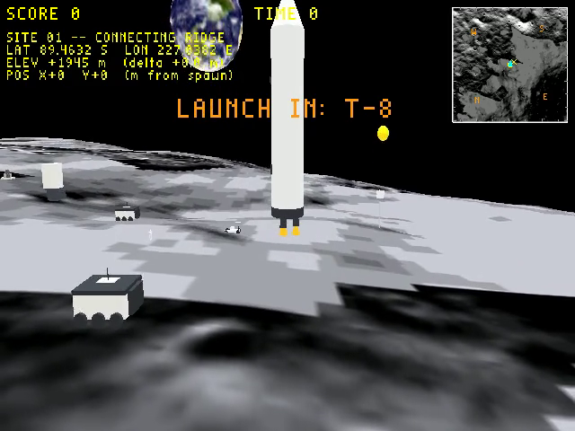
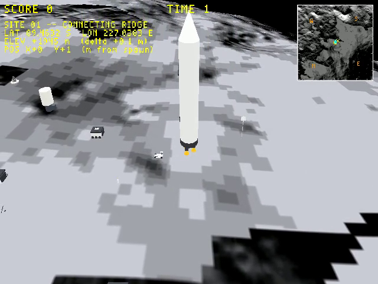
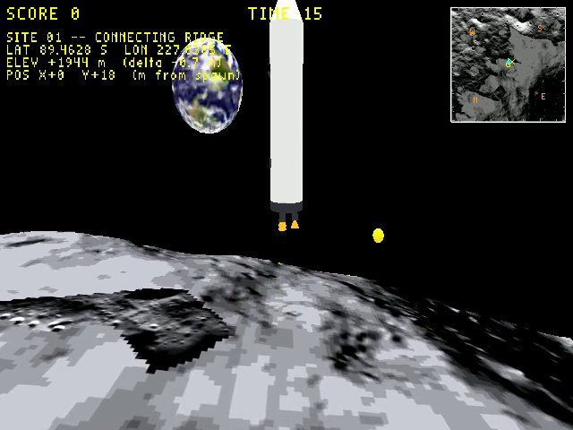
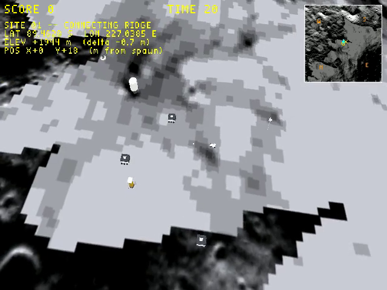

# moon_site01 — PGDA Site 01 Connecting Ridge

Artemis-era lunar surface level. Player explores real LOLA terrain at 1:1 scale
and witnesses the Starship HLS Artemis lander launch sequence.

## Coordinates

LOLA tile centred at **26.13° N, −3.62° E** (Connecting Ridge near PGDA Site 01,
candidate Artemis landing zone). 1 km × 1 km play area. WF unit = 1 metre.

World-space origin = centre of the terrain tile.

## Directory contents

| File / dir | What it is |
|------------|-----------|
| `blender_create_moon.py` | Golden source — procedural scene; exports `moon_site01.lev` |
| `dem_to_grid.py` | Converts raw LOLA DEM data → `terrain_heights.json` / `.npy` |
| `make_terrain_texture.py` | Builds `terrain_texture.tga` (1024²) from LRO NAC mosaic |
| `data/` | Raw DEM tiles and NAC source images |
| `terrain_heights.json/.npy` | Pre-processed heightfield grid (100×100, 10 m/sample) |
| `terrain_texture.tga` | NAC mosaic (1024×1024, 1 texel/m) — Room0 atlas |
| `earth.tga` | NASA Blue Marble, 128×64 equirectangular — PERM atlas |
| `minimap.tga` | Hillshade minimap baked offline |
| `textile.flags` | Per-level atlas page size overrides for textile-rs |
| `moon_site01.lev` | Blender export (text IFF) — input to build pipeline |
| `moon_site01-standalone.iff.txt` | L4 wrapper for engine-loadable standalone build |
| `*.iff` | Compiled mesh assets (output of build pipeline) |
| `*.tga / *.ruv / *.cyc` | Packed atlas pages (output of textile-rs) |

## Scene structure

```
Room0 (terrain tile — 1 km²)
  lunar_terrain.iff     100×100 quad grid from LOLA DEM
                        textured by terrain_texture.tga (Room0 atlas, 1024²)

PERM (always loaded — props)
  player.iff            Astronaut character (Physics actor)
  artemis_lander.iff    Starship HLS primitive build at 1:1 scale (Anchored)
  earth.iff             Earth sphere R=20 m at (0, 200, 50) (Anchored)
  moon_racer.iff        Moon RACER LTV rover (Anchored, foreground)
  vsat_tower.iff        VSAT comms tower
  lunar_cruiser.iff     Lunar Cruiser / LTV concept
  blue_moon_mk1.iff     Blue Moon Mk1 lander
  fsh.iff               Forward Support Habitat (FSH)
  fsp_reactor.iff       Fission Surface Power (FSP) reactor + radiator
  cs_chase              Vista camshot (no model)
  cs_earth              Launch cutscene camshot (no model)
  launch_tracker        Invisible proxy actor; Z_POS follows lander (see below)
  sun_disc.iff          Visible sun — UV sphere R=8 m at (164, 451, 17) (Anchored)
  skydome.iff           Star-field skydome — UV sphere R=2000 m, inverted normals (Anchored)
```

**Architecture rule:** Room0 atlas (1024×1024) holds the terrain tile only.
All props must carry `wf_Moves Between Rooms = True` in `blender_create_moon.py`.
**PERM pool** is set in `moon_site01-standalone.iff.txt`; budget ~2.5 × total prop
`.iff` file sizes. Currently 1,000,000 bytes.

**VRAM note:** The PERM atlas grows when textured PERM actors are added (starfield.tga
512×256 + earth.tga 128×64 → Perm.tga 640×256). `VRAMPermanentWidth` defaults to 256 —
exceed that and the engine asserts at startup. `task run-moon` passes
`--vram-perm-width=1024 --vram-perm-height=512` to cover current + future PERM textures.

## Atlas pages (textile.flags)

| Page | Size | Contents |
|------|------|----------|
| Room0.tga | 1024 × 1024 | terrain_texture.tga (NAC mosaic, 1 texel/m) |
| Perm.tga  | 1024 × 1024 | astronaut + lander (procedural colour) + earth.tga (128×64) |

## Build pipeline

`blender_create_moon.py` is the golden source; there is no saved `.blend` file.

```
blender --background --python blender_create_moon.py   # → moon_site01.lev
task build-level -- moon_site01                        # → moon_site01-standalone.iff
task run-moon                                          # run in engine
```

`task build-level` chains five steps (iffcomp-rs → levcomp-rs → textile-rs →
iffcomp-rs × 2). See `wftools/wf_blender/build_level_binary.sh`.

To rebuild the terrain texture from source NAC data: `python3 make_terrain_texture.py`.
To re-derive the heightfield from new DEM tiles: `python3 dem_to_grid.py`.

## Mailboxes

| Constant | Index | Description |
|----------|-------|-------------|
| `MOON_PLAYER_HEADING` | 1879 | player heading (revolutions) for minimap |
| `MOON_LAUNCH_TIMER` | 1880 | reserved |
| `MOON_LAUNCH_PHASE` | 1881 | 1=countdown 2=ignition 3=ascent |
| `MOON_LAUNCH_T_MINUS` | 1882 | seconds into current phase |
| `MOON_CHASE_CAM_IDX` | 1883 | actor index of `cs_chase`; written by its startup script |
| `MOON_EARTH_CAM_IDX` | 1884 | actor index of `cs_earth`; written by its startup script |
| `MOON_LANDER_Z` | 1885 | lander altitude (m); written by lander script, read by `launch_tracker` |

## Launch sequence

Triggered automatically by level clock. Phases driven by `INDEXOF_TIME`
(level-clock seconds):

| Time | Phase | T_MINUS | HUD |
|------|-------|---------|-----|
| 0–10 s | 1 countdown | 10→0 | `LAUNCH IN T-N` banner |
| 10–11 s | 2 ignition | 0 | `IGNITION` banner; Raptor exhaust visible |
| 11 s+ | 3 ascent | seconds since ignition | TIME counter → mission-elapsed |

Lander Z during ascent: `z = 0.5 × T_MINUS²` (m); despawned at z > 500 m (T_MINUS ≈ 32 s).

## Cutscene cameras

| Camera | When active | Position | FOV | Yon | Track Object |
|--------|-------------|----------|-----|-----|-------------|
| `cs_chase` | always (default) | (0, −100, 80) vista | 60° | 500 m | Player |
| `cs_earth` | phase ≥ 2 (t=10 s) until T_MINUS > 13 s | (30, −80, 5) behind lander | 40° | 500 m | `launch_tracker` |

`launch_tracker` is an invisible room actor at lander XY whose Z_POS mirrors `MOON_LANDER_Z`
each frame. `cs_earth` tracks it instead of `artemis_lander` directly because PERM→PERM
`GetObject` returns null at runtime (see level-design-troubleshooting.md).

## HUD

- Top-left: SCORE / TIME / LAT / LON / ELEV / POS
- Top-right: 128×128 minimap (hillshade NAC + spawn square + lander × + player
  dot + compass chevron + cardinal labels N/S/E/W)

## Lighting

- Sun (directional): azimuth ~60°, elevation ~30° — matches LOLA illumination
  at site latitude
- Ambient light: RGB (0.40, 0.42, 0.50) — fills crater shadow sides

## Recordings

| File | Date | Notes |
|------|------|-------|
| [20260604_064139_moon.mp4](../../20260604_064139_moon.mp4) | 2026-06-04 | First windowed 640×480 run — cs_hold establishing shot + cs_earth lander tracking |

### Camera shots — 20260604_064139

| Shot | Camera | Frame |
|------|--------|-------|
| cs_hold — terrain establishing | ground-level wide, lander on pad |  |
| cs_earth — liftoff | behind/below, lander rising |  |
| cs_earth — ascent (Earth in frame) | tilting up, Earth visible low-left |  |
| cs_earth — space shot | pointing up, Earth below lander |  |

## Reference

- [Texture LOD sizing](../../docs/investigations/2026-06-02-texture-lod-for-distant-spheres.md)
- [Artemis lander build](../../docs/plans/2026-05-31-moon-artemis-lander.md)
- [Launch sequence](../../docs/plans/2026-06-02-moon-lander-launch-sequence.md)
- [Earth cutscene camera](../../docs/plans/2026-06-03-moon-earth-cutscene.md)
- [Surface asset models](../../docs/plans/2026-06-03-moon-site-01-surface-asset-models.md)
- [Future surface assets](../../docs/investigations/2026-06-02-moon-site01-future-surface-assets.md)
